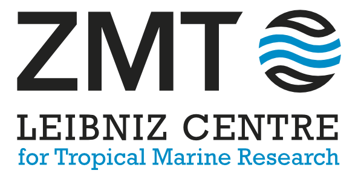

# Calkulate

Calkulate is a Python package for finding total alkalinity [[D91](references/#d)] from titration data using [PyCO2SYS](https://pyco2sys.rtfd.io) [[HLSP22](references/#h), [HSS22](references/#h)].

## Installation

    pip install calkulate
    conda install conda-forge::calkulate

## Basic use

If the [data for each individual titration](read/#individual-titration-data-files) is in its own text file and you have [a spreadsheet containing the metadata](metadata) for each titration on separate rows — all formatted as expected — then all you need to do with Calkulate is:

```python
import calkulate as calk
data = calk.read_csv("path/to/metadata_file.csv").calkulate()
data.alkalinity  # <== here are your alkalinity results
```

`data` is then a pandas DataFrame based on the metadata file you provided but with some extra columns added such as `data.alkalinity`, which contains the fully calibrated total alkalinity for each sample.

Other read-in functions are also available (e.g., for [Excel spreadsheets and VINDTA .dbs files](read/#import-from-excel-csv-or-dbs)).

See [Dataset methods](methods) for more information on what `calkulate` does.

## About

Calkulate is being developed primarily by [Dr Matthew P. Humphreys](https://www.nioz.nl/en/about/organisation/staff/matthew-humphreys) at the Royal Netherlands Institute for Sea Research ([NIOZ, Texel](https://www.nioz.nl/en)).

## Citation

If you use Calkulate in your work, please cite it as:

> Humphreys, M. P. and Matthews, R. S. (2024).  Calkulate: total alkalinity from titration data in Python.  *Zenodo.*  [doi:10.5281/zenodo.2634304](https://doi.org/10.5281/zenodo.2634304).

Please specify which version you are using.  To find this:

```python
import calkulate as calk
calk.hello()
```

## License

Calkulate is licensed under the [GNU General Public License version 3 (GPLv3)](https://www.gnu.org/licenses/gpl-3.0.en.html).

## Users

Calkulate is or has been used by researchers from (at least) the following institutes/companies - please get in touch if you're also using it and don't mind being added here!

<div style='background-color:#fff; text-align:center; border-radius:10px 10px 0 0'>
<a href='https://www.nioz.nl/' target='_blank'></a>
<a href='https://www.geomar.de/en/' target='_blank'></a>
<a href='https://www.seao2.com/' target='_blank'></a>
</div><div style='background-color:#fff; text-align:center'>
<a href='https://www.southampton.ac.uk/' target='_blank'></a>
<a href='https://uol.de/' target='_blank'></a>
<a href='https://www.mit.edu/' target='_blank'></a>
</div><div style='background-color:#fff; text-align:center'>
<a href='https://noc.ac.uk/' target='_blank'></a>
<a href='https://www.leibniz-zmt.de/' target='_blank'></a>
<a href='https://www.uea.ac.uk/' target='_blank'></a>
</div><div style='background-color:#fff; text-align:center; border-radius:0 0 10px 10px'>
<a href='https://www.oberlin.edu/' target='_blank'></a>
<a href='https://www.utas.edu.au/' target='_blank'></a>
<a href='https://www.fau.edu/' target='_blank'></a>
</div>